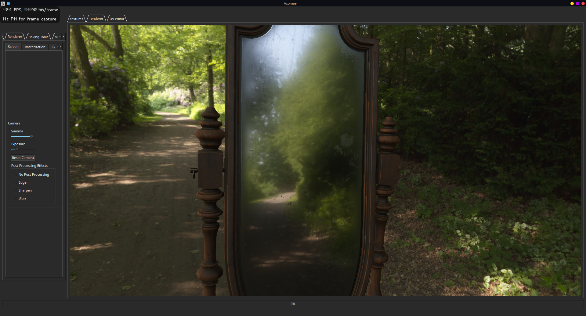
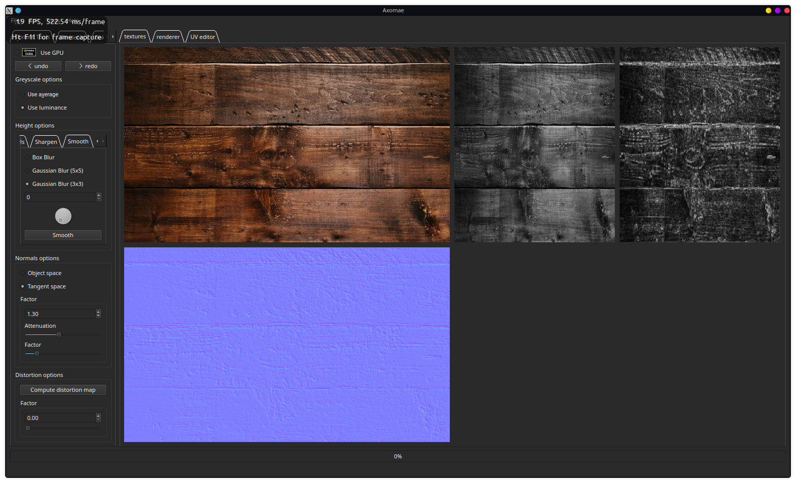

# Axomae

## Overview:

Axomae is an image processing tool used for texture baking and viewing 3D models.  

## Features:

### Physically Based 3D renderer : 

### Normal Map baking : 

### Normal Distribution , UV layout : 

## Upcoming features : 

- Command line irradiance baking. 
- Traditional normal map baking. 
- Raytracing engine. 
- Automatic occluder generation for occlusion culling. 