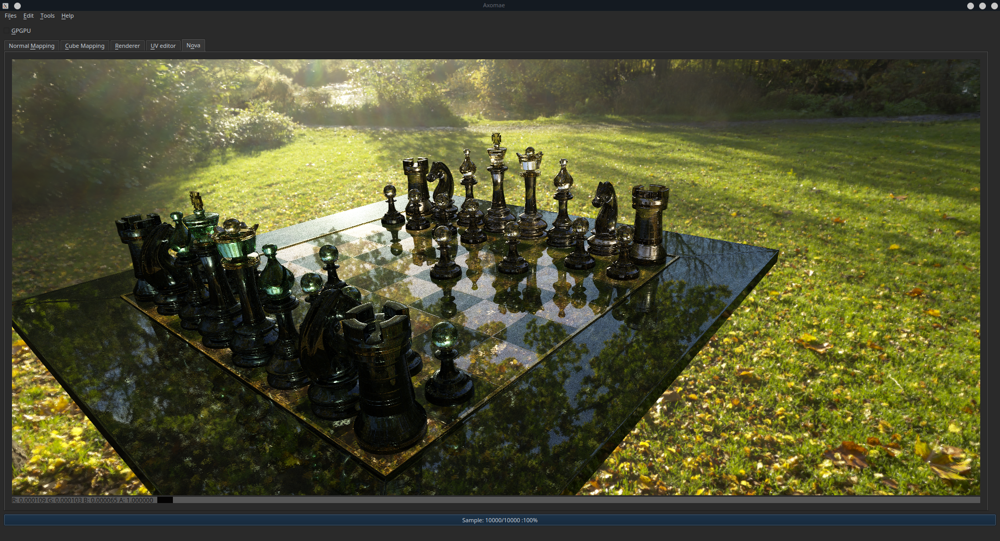
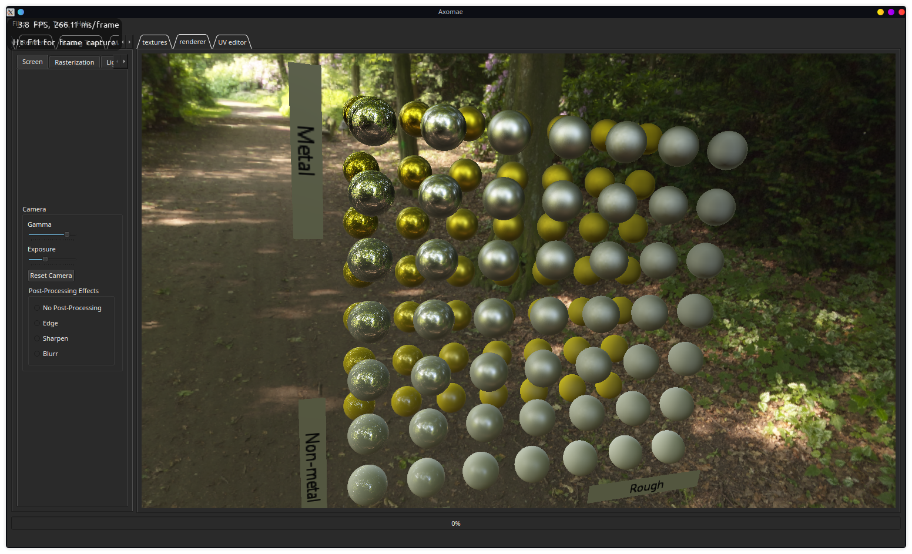
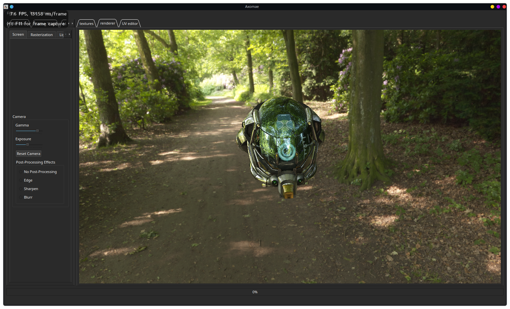
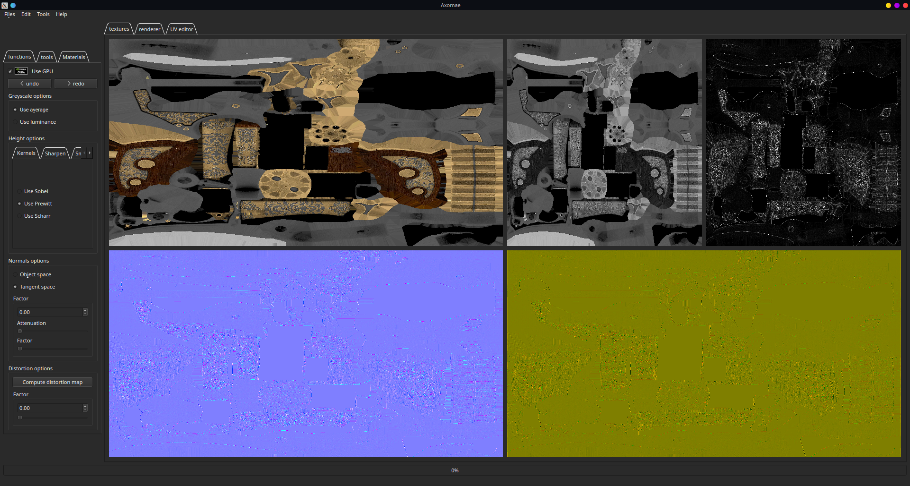
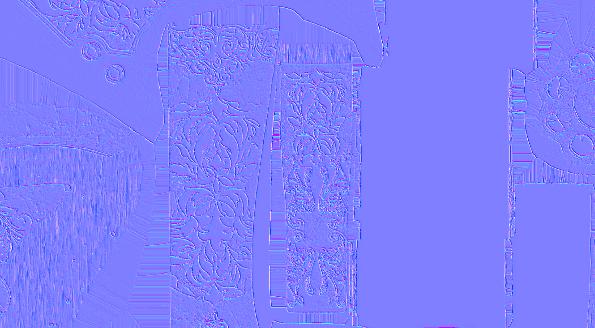
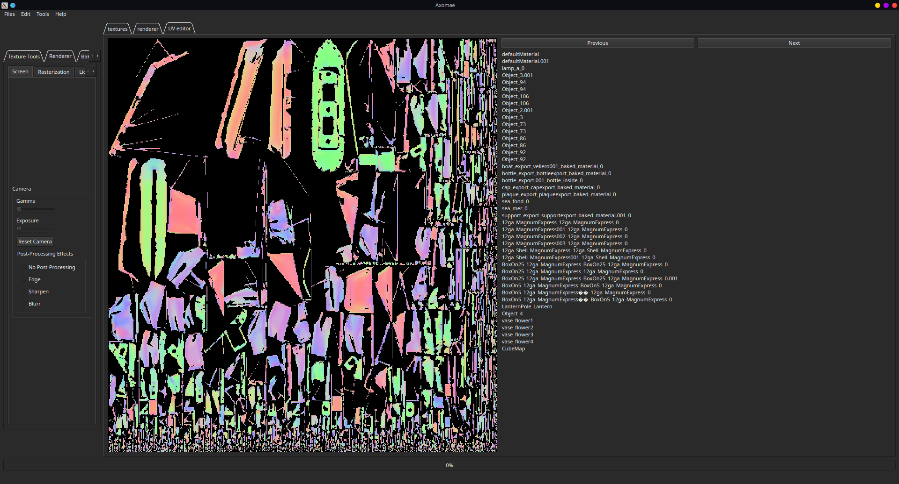

# Axomae
 

# Table Of Contents:
* [Introduction](#Introduction)
* [Features](#Features)

## Introduction 

Axomae is a 3D rendering engine and raytracer, designed as a foundation to explore advanced rendering techniques .    
The goal of the software is to facilitate the implementation of research papers , testing , and display of photorealistic images. 

## Features:
### Nova 
Nova is the first iteration of our multithreaded path tracing engine

Nova will also integrate a wave optic rendering engine in the near future. 

### Physically Based 3D renderer : 

### Normal Map baking :

### UV Editor:

