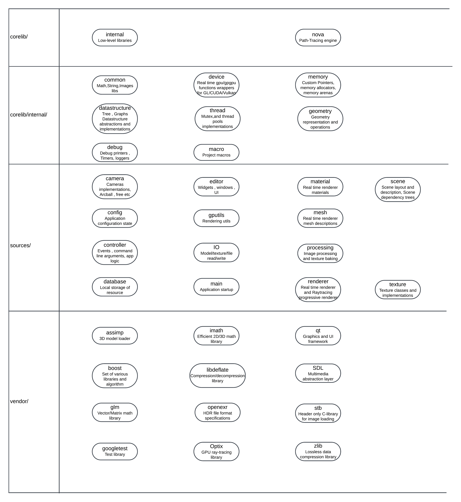

# Axomae
 

[](https://deepwiki.com/HamilcarR/Axomae)


# Table Of Contents:
* [Introduction](#Introduction)
* [Features](#Features)
* [Requirements](#Requirements)
* [Installation](#Installation)
* [Documentation](#Documentation)


## Introduction

Axomae is a 3D rendering engine and raytracer, designed as a foundation to explore advanced rendering techniques .    
The goal of the software is to facilitate the implementation of rendering algorithms and display of photorealistic images. 
At the same time, the application is intended to be interactive , and customizable. 

## Features

* Nova: A multi-thread path-tracer , currently implemented to be scalable and distributed on GPU. Nova can be used as an offline renderer, or a pseudo-realtime , more interactive viewer. 
* UV-editor
* (Old feature) A normal map generation tool : Will probably be scrapped for an entirely new material generation pipeline. 
* .hdr texture viewer.
* PBR rasterizer 3D viewer. 

## Requirements

* GCC 
* Qt6(Axomae can also build Qt from source , see [Installation](#Installation) for details)
* OpenGL
* Glew
* Cuda 12.x + Optix > 8.0.x (Optional)
* Any Linux distribution

## Installation

### First clone the repository : 

```
$ mkdir Axomae-git
$ cd Axomae-git
$ git clone https://github.com/HamilcarR/Axomae

```

### Download the dependencies : 

```
$ cd Axomae
$ ./scripts/update_deps.sh

```

### Build the project : 

Axomae doesn't support in-source builds, so I suggest building in the parent folder: 
Note that: 

- Building Unit tests is enabled by default , set ```-DAXOMAE_BUILD_TESTS=OFF``` if they are not needed. 
- Building QT from source is enabled by default. It is more reliable to build Axomae and it's dependencies through a unique toolchain, but it will take longer(~15 min on an 8 cores ... Build time optimizations are on the backlog. )
- If nonetheless you can use your own QT system library , use ```-DAXOMAE_FROMSOURCE_QT_BUILD=OFF``` .
- For CUDA , use ```-DAXOMAE_USE_CUDA=ON```.
```
$ cd Axomae
$ cmake -S . -B ../build -DAXOMAE_BUILD_TESTS=OFF -DAXOMAE_FROMSOURCE_QT_BUILD=OFF
$ cd ../build
$ make
```

## Documentation
### Architecture and modules : 


### Bibliography : 
- Multiple-Scattering Microfacet Model for Real-Time Image-based Lighting - Carmelo J.Fdez-Aguera
- Physically Based Rendering: From Theory To Implementation - Matt Pharr, Wenzel Jakob, and Greg Humphreys
- Fast Minimum Storage Ray/Triangle Intersection - Thomas Müller , Ben Trumbore
- Unbiased physically based rendering on the GPU - Dietger van Antwerpen
- Wide BVH Traversal with a Short Stack - K.Vaidyanathan, S.Woop, C.Benthin
- A Generalized Ray Formulation For Wave-Optics Rendering - Shlomi Steinberg, Ravi Ramamoorthi, Benedikt Bitterli, Eugene D'Eon, Ling-Qi Yan, Matt Pharr
- Realtime Ray Tracing on current CPU Architectures - Carsten Benthin
- ALGORITHM 659 Implementing Sobol’s Quasirandom Sequence Generator - Paul Bratley, Bennett L.Fox
- Stochastic Generation of (t, s) Sample Sequences - Andrew Helmer, Per Christensen, Andrew Kensler
- Megakernels Considered Harmful: Wavefront Path Tracing on GPUs - Samuli Laine, Tero Karras, Timo Aila
- Practical Hash-Based Owen Scrambling - Brent Burley
