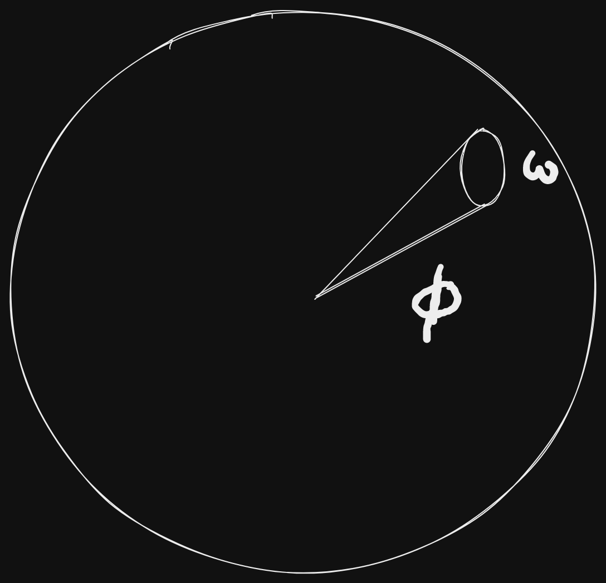
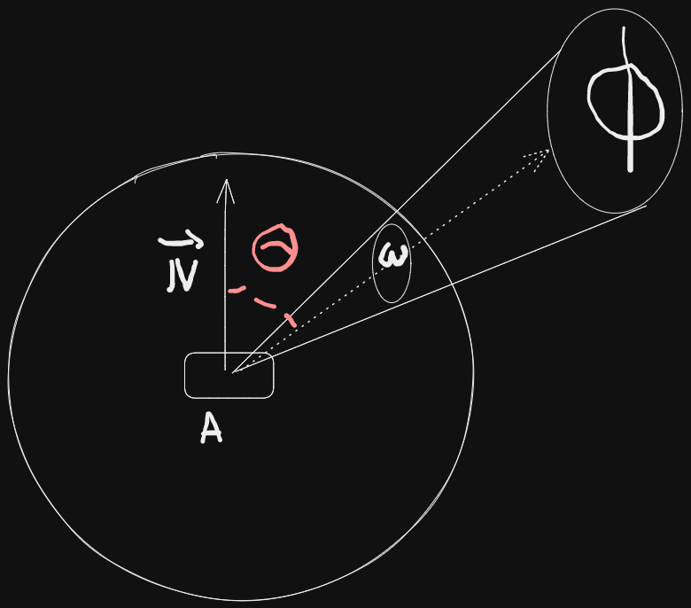

# Physically based rendering
## Concepts

### Energy conservation : 
- total amount of light reflected from surface cannot exceed total amount received . 
### Microfacets: 
Surface composed of microfacets that reflect light independantly. 
- rough : reflect light more chaotically
- smooth : more uniformity 
### BRDF : 
Bidirectional Reflectance Distribution Function , describes how light is reflected from a surface in different directions based on material properties. typically include :
- diffuse lighting (light scattering) 
- specular lighting (mirror like reflections). 
### Maps and textures:
- Albedo , normal maps , metal roughness , IBL etc . 

### Reflectance equation : 
$$L(o, ωo) = Le(o, ωo) + \int_{\Omega}BRDF(p, ωi, ωo) * L(p, ωi) * dot(n, ωi) * dω$$
- Radiant flux $\phi$: sum of wavelengths = RGB color of light . 
- Solid angle $\omega$: This simulates the incidence of multiple rays of light over a small area . It represents the projection of an area on a unit sphere. 
- Radiant intensity : Amount of Radiant flux per solid angle.

The equation for radiant intensity is  :
$$I = \frac{d\phi}{d\omega}$$

- Radiance : This is the total energy on Area "A" over a solid angle $\omega$ with radiant intensity $\phi$ 

The radiance equation is : 

$$L = \frac{d²\phi}{dAd\omega cos\theta}$$

### Reflectance equation for a fragment : 
$$L_0(p,\vec{\omega_0}) = \int_\Omega BRDF(p , \vec{\omega_i} , \vec{\omega_0}) L_i(p , \vec{\omega_i})\vec{n}.\vec{\omega_i} d\vec{\omega_i}$$

- $\vec{\omega_0}$ : Direction from the fragment to the camera.
- $p$ : infinitesimally small point represented by area "A" , or , in this case , a fragment . 
- $L_0(p,\vec{\omega_0})$ : Reflected sum of all lights irradiances falling on point p , viewed by direction $\vec{\omega_0}$
- $\vec{n}.\vec{\omega_i}$ : represents the $cos\theta$ between the normal $\vec{n}$ and direction $\vec{\omega_i}$
- $\Omega$ : Represents a hemisphere around the point $p$.

## Reflectance integral resolution: 
### Code: 

    int steps = STEP_SIZE ; 
    float sum = 0.f ; 
    vec3 P = fragPos() ; 
    vec3 W0 = view_direction(); 
    vec3 N = fragNormal(); 
    float dW = 1.f / steps; 
    for(int i = 0 ; i < steps ; i++){
        vec3 Wi = -getLightDir(i);
        sum += BRDF(P , Wi , W0) * L(P , Wi) * dot(N , Wi) * dW ; 
    }

## Bidirectional Reflective Distribution Function : 
- Takes as input :
    1. $\vec{\omega_i}$ : Light $i$ direction.
    2. $\vec{n}$ : Normal of the surface.
    3. $a$ : Roughness surface parameter.

- Approximates how much light $\vec{\omega_i}$ contributes to the final reflected light on a surface given it's material property. 
- Perfectly smooth surface returns BRDF = 0 for all $\vec{\omega_i}$ , except the only ray that reflects towards $\vec{\omega_0}$ which returns BRDF = 1.
- BRDF is valid only if the reflected light is less than the sum of incoming light (energy conservation , see inequality on next equations). 

### Cook-Torrance model : 
$$f_r=k_df_{lambert} + k_sf_{cook-torrance}$$
- $f_r$ : Reflected light intensity at point $p$.
- $k_d$ : Diffuse reflection coefficient.
- $k_s$ : Specular reflection coefficient.
- $f_{lambert}$ : Lambertian diffuse component
- $f_{cook-torrance}$ : Specular reflection component.

$$\forall \vec{\omega_{i}} \in \mathbb{L} , \int_{\Omega}f_r(\vec{n} . \vec{\omega_0})d\vec{\omega_0} \leq 1 $$

The equations reads : "For all Light $\omega_i$ hitting the surface , the sum of outgoing BRDF weights in the hemisphere $\Omega$ multiplied by $cos\theta = \vec{n}.\vec{\omega_0}$ must be smaller than 1 . 

### Diffuse component : 
$$f_{lambert} = \frac{c}{\pi}$$

- $c$ : Albedo color

### Specular component : 
$$f_{cook-torrance} = \frac{DFG}{4(\vec{\omega_0}.\vec{n})(\vec{\omega_i}.\vec{n})}$$

This equation is composed of : 
- $f_{cook-torrance}$ : Specular component of the model.
- D : Normal Distribution Function => approximates the amount of surface microfacets aligned to the halfway vector , influenced by the roughness of the surface. 
- G : Geometry Function : Describes the self shadowing properties of the microfacets . 
- F : Fresnel Equations : Describes the amount of reflection at certain angles.

There are many other specular functions : [here](http://graphicrants.blogspot.com/2013/08/specular-brdf-reference.html)

## BRDF Sub-functions : 
### Normal Distribution Function , "Trowbridge-Reitz GGX" : 

$$ NDF(\vec{n} , \vec{h} , \alpha) = \frac{\alpha²}{\pi ((\vec{n}.\vec{h})²(\alpha² - 1) + 1)²}$$ 
- $\vec{n}$ : surface normal.
- $\vec{h}$ : halfway vector.
- $\alpha$ : surface roughness.

### Code : 
    float distributionGGX(vec3 h , vec3 n , float a){
        float aa = a*a ;
        float dot_normalized = max(dot(n , h), 0.f);  
        float dot_n_h_2 = dot_normalized * dot_normalized; 
        float divid = (dot_n_h_2 * (aa - 1) + 1); 
        divid *= divid; 
        divid *= PI ; 
        return aa/divid ; 
    }

### Geometry Function  , Schlick-GGX: 
Allows to provide "self shadowing microfacets" 

$$ G_{SchlickGGX}(\vec{n} , \vec{v} , k) = \frac{\vec{n}.\vec{v}}{(\vec{n}.\vec{v})(1 - k ) + k}$$

with : 
- $\vec{n}$ : surface normal , normlized.
- $\vec{v}$ : view direction , normalized.
- $k$ : remapping of $\alpha$ , defined as :   

$$ k = \begin{cases}
   k_{direct} = \frac{(\alpha +1)²}{8}  \\
   k_{IBL} = \frac{\alpha²}{2} \\
\end{cases}$$

### Smith Method : 
Approximation of the geometry , taking a view direction + light direction vectors : 

$$G(\vec{n} , \vec{v} , \vec{l} , k) = G_{sub}(\vec{n} , \vec{v} , k)G_{sub}(\vec{n} , \vec{l} , k)$$

with : $$G_{sub} = G_{SchlickGGX}$$

- The geometry function is a multiplier between [0.0, 1.0] with 1.0 (or white) measuring no microfacet shadowing, and 0.0 (or black) complete microfacet shadowing.

### Code : 
    float GeometrySchlickGGX(float NdotV, float k)
    {
    float nom   = NdotV;
    float denom = NdotV * (1.0 - k) + k;
    return nom / denom;
    }

    float GeometrySmith(vec3 N, vec3 V, vec3 L, float k){
    float NdotV = max(dot(N, V), 0.0);
    float NdotL = max(dot(N, L), 0.0);
    float ggx1 = GeometrySchlickGGX(NdotV, k);
    float ggx2 = GeometrySchlickGGX(NdotL, k);
    return ggx1 * ggx2;
    }

### Fresnel Equations : 
The equations for the dielectric case : 
$$F_{Schlick}(\vec{h} , \vec{v} , F_0) = F_0 + (1 - F_0)(1-(\vec{h}.\vec{v}))^5 = F_0 + (1-F_0)(1-cos\theta)^5$$
$$F_0=\left(\frac{\eta_1 - \eta_2}{\eta_1+\eta2}\right)²$$
With : 
- $\eta_1$ , $\eta_2$ : Reflection and refraction coefficients . 
- $\theta$ : Angle between the view direction and the half vector . 

Conductor case : 
$$F = \frac{(\eta - 1)² + 4\eta(1-cos\theta)^5 + k^2}{(\eta + 1)² + k²}$$
With : 
- $\eta$ : Index of refraction for the conductor . 
- $k$ : Absooption coefficient for the conductor . 

### Code : 

    vec3 F0 = vec3(abs((1.0 - ior)/(1.0 + ior)));  //We consider the incident ray's first medium is air. 
    F0 *= F0;
    F0 = mix(F0 , albedo.rgb , metallic);

    vec3 fresnelSchlick(float cosT , vec3 F0){
        return F0 + (1 - F0) * pow(1 - cosT , 5) ; 
    } 

